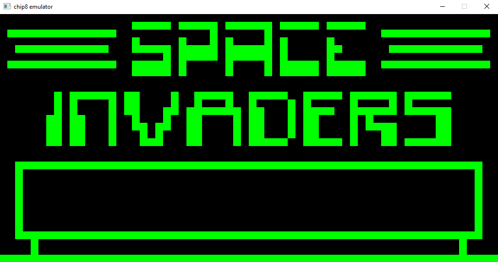
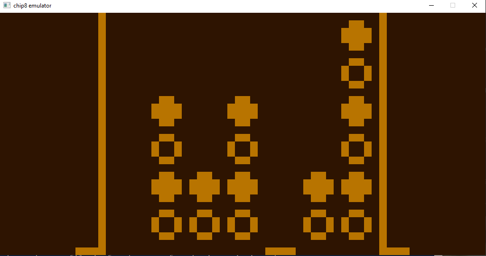
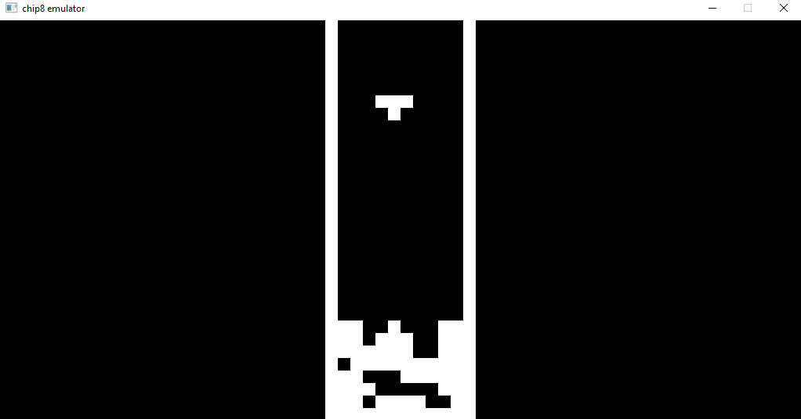

# chip8Emulator
A fully functional CHIP-8 interpreter written in C for Windows systems.

## Features
* All of CHIP-8's 35 opcodes are properly processed
* Provides graphics and input support with SDL2
* Various colour schemes
* Ability to increase or decrease the frequency of emulation cycles (so that all programs can run as intended)
* Sound support (provided that "sound.wav" is provided in the same directory as the ROM file)

## Screenshots
### Space Invaders 

### Connect 4 

### Tetris 

## Running the emulator
To run the emulator, you must build it first. Unfortunately, I couldn't get a CMakeLists.txt file to work properly with SDL2 on either of my two machines, so linking and properly including the library will have to be done manually. Make sure to include and link SDL_mixer as well!

Once built, one simply uses the following command in a shell: .\\\<executable-name> \<ROM-file> <optional: colour scheme> <optional: milliseconds per emulation cycle>
